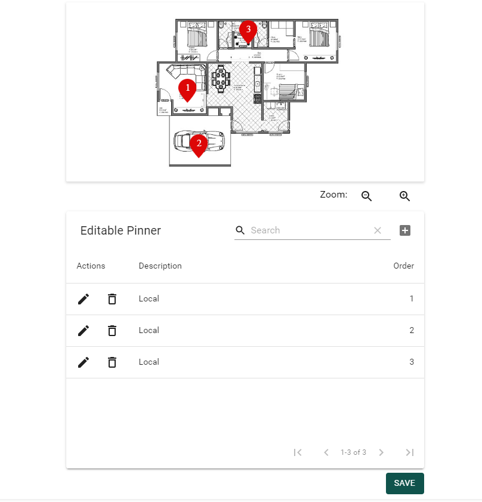

<h1>Image Pinner - V1.0</h1>

O component tem como objetivo gerenciar marcadores sobre uma imagem. 

**Preview ImagePinner:**



Essa primeira versão atende os requisitos da user storie '*US0026 – Componente Pins no Ground Plan*'

**Exemplo de uso:**

O component ImagePinner necessita de 4 inputs, veja abaixo:

| Property      | Type     | Required |
| ----------- | -------- | -------- |
| onSaved       | `void` | true     |
| data     | `IPin[]` | false    |
| srcImg | `string` | true    |
| zoom | `number` | true    |


```javascript
const Component2 = () => (
  <ImagePinner
    onSaved={e => console.log(e)}
    data={result.data}
    srcImg={'image.jpg'}
    zoom={70}
  />
);
```

**Propriedades de IPin:**

A propriedade selection serve apenas para gerenciar os pins no frontend, não é necessário persistir esse campo.  

```typescript
export interface IPin {
  id: string;
  selection: d3.Selection<SVGImageElement, unknown, null, undefined>;
  initX: number;
  initY: number;
  endX: number;
  endY: number;
  mouseX: number;
  mouseY: number;
  order: number;
  description: string;
}
```

**Exemplo input data/IPin[]:**

```javascript
data: [
    {
      id: '3510b8ca-df7e-b0e3-f8d2-3d65dabd135d',
      initX: 183.00000381469727,
      initY: 128,
      endX: 183.00000381469727,
      endY: 128,
      mouseX: 188.8000030517578,
      mouseY: 131,
      order: 1,
      description: 'Local'
    },
    {
      id: 'g57e8ac32-78c2-6e3f-680c-4e0b719214b9',
      initX: 202.00000286102295,
      initY: 221,
      endX: 202.00000286102295,
      endY: 221,
      mouseX: 209.8000030517578,
      mouseY: 253,
      order: 2,
      description: 'Local',
    },
    {
      id: 'g0351953e-99f3-1f83-d1a0-44bac126b0bf',
      initX: 284.9999876022339,
      initY: 30,
      endX: 284.9999876022339,
      endY: 30,
      mouseX: 307.79998779296875,
      mouseY: 24,
      order: 3,
      description: 'Local',
    }
  ]
```

**Exemplo output onSaved:**

```javascript
{
  zoom: 70,
  data: [
    {
      id: '3510b8ca-df7e-b0e3-f8d2-3d65dabd135d',
      selection: {},
      initX: 183.00000381469727,
      initY: 128,
      endX: 183.00000381469727,
      endY: 128,
      mouseX: 188.8000030517578,
      mouseY: 131,
      order: 1,
      description: 'Local',
      tableData: {
        id: 0
      }
    },
    {
      id: 'g57e8ac32-78c2-6e3f-680c-4e0b719214b9',
      selection: {},
      initX: 202.00000286102295,
      initY: 221,
      endX: 202.00000286102295,
      endY: 221,
      mouseX: 209.8000030517578,
      mouseY: 253,
      order: 2,
      description: 'Local',
      tableData: {
        id: 1
      }
    },
    {
      id: 'g0351953e-99f3-1f83-d1a0-44bac126b0bf',
      selection: {},
      initX: 284.9999876022339,
      initY: 30,
      endX: 284.9999876022339,
      endY: 30,
      mouseX: 307.79998779296875,
      mouseY: 24,
      order: 3,
      description: 'Local',
      tableData: {
        id: 2
      }
    }
  ]
}
```


*@Autor - Vini Oliveira*

*@MelhorAmigo - Jojo*